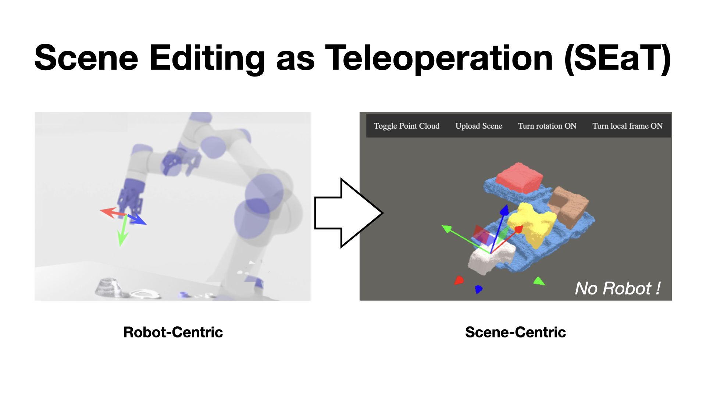

# Scene Editing as Teleoperation: A Case Study in 6DoF Kit Assembly
[Shubham Agrawal](https://submagr.github.io/),
[Yulong Li](https://www.columbia.edu/~yl4095/),
Jen-shuo Liu,
[Steven Feiner](http://www.cs.columbia.edu/~feiner/),
[Shuran Song](https://www.cs.columbia.edu/~shurans/)
<br>
Columbia University
<br>

### [Project Page](https://seat.cs.columbia.edu) | [Video](https://youtu.be/-NdR3mkPbQQ) | [arXiv](https://arxiv.org/abs/2110.04450)

<br>



<br>

## Catalog

- [Environment](#Environment)
- [Dataset](#Dataset)
- [Training and Testing](#Training-and-testing)
- [System Tests with Real-World Dataset](#System-Tests-with-Real-World-Dataset)
  
## Environment
```
conda env create -f environment.yml
conda activate telerobot
pip install -e .
```
Install other dependencies for visualization and system tests:
- [gifsicle](https://www.lcdf.org/gifsicle/)
- [flask](https://flask.palletsprojects.com/en/2.0.x/installation/)
- node v.16 through [nvm](https://github.com/nvm-sh/nvm)

## Dataset
We create our dataset by procedurally processing [ABC Dataset](https://cs.nyu.edu/~zhongshi/publication/abc-dataset/). The following scripts default to generate the same dataset we used for all model trainings, but you could always generate diifferent data by either
1. download different ABC data chunks by modifying [get_abc_data.sh](get_abc_data.sh);
2. modify [train_sc.txt](dataset/train_sc.txt), [val_sc.txt](dataset/val_sc.txt), the training and validation data paths for scene completion, and/or [train.txt](dataset/train.txt), [val.txt](dataset/val.txt), the training and validation data paths for action snapping. 
3. modify the random seeds, ```data_split``` and/or ```data_gen```, in [config.yaml](conf/config.yaml).

We enable [ray](https://www.ray.io) for parallel processsing if your machine support multiple GPUs/CPUs, but ray is default to disabled. To enable ray, you can run commands with additional flags. For example
```bash
# Without ray
python data_generation.py data_gen=seg_sc data_gen.dataset_size=2000 data_gen.dataset_split=train_sc data_gen.scene_type=kit
# With ray, using 4 GPUs, with CUDA IDs 0,1,2,3, and 48 CPUs.
CUDA_VISIBLE_DEVICES=0,1,2,3 python data_generation.py data_gen=seg_sc data_gen.dataset_size=2000 data_gen.dataset_split=train_sc data_gen.scene_type=kit ray.num_cpus=48 ray.num_gpus=4
```
### Download ABC data
``` bash
./get_abc_data.sh
```
### Preprocess ABC data
Process ABC Dataset to generate scaled objects and respective kits:
```bash
python prepare_dataset.py
```
Optionally evaluate processed dataset:
```bash
python evaluate.py evaluate=prepared_data evaluate.path=dataset/ABC_CHUNK
# To visualize:
cd dataset/ABC_CHUNK
python -m http.server 8000 # go to localhost:8000
```

### Segmentation and shape completion dataset
```bash
# Training set:
python data_generation.py data_gen=seg_sc data_gen.dataset_size=2000 data_gen.dataset_split=train_sc data_gen.scene_type=kit
python data_generation.py data_gen=seg_sc data_gen.dataset_size=2000 data_gen.dataset_split=train_sc data_gen.scene_type=object
```
Optionally, visualize the generated data using:
```bash
# kit
python evaluate.py evaluate=data evaluate.dataset_split=train_sc evaluate.scene_type=kit evaluate.num_samples=1
# To visualize:
cd dataset/sc_abc/train_sc; python -m http.server 8000 # go to localhost:8000
# object
python evaluate.py evaluate=data evaluate.dataset_split=train_sc evaluate.scene_type=object evaluate.num_samples=1
# To visualize:
cd dataset/sc_abc/train_sc; python -m http.server 8000 # go to localhost:8000
```

### SnapNet dataset
```bash
# Training set:
python data_generation.py data_gen=vol_match_6DoF vol_match_6DoF.dataset_size=1000 vol_match_6DoF.dataset_split=train 
# Validation set:
python data_generation.py data_gen=vol_match_6DoF vol_match_6DoF.dataset_size=100 vol_match_6DoF.dataset_split=val
```
Optionally, visualize the generated data using:
```bash
python evaluate.py evaluate=vol_match_6DoF vol_match_6DoF.dataset_split=val vol_match_6DoF.dataset_size=3
# To visualize:
cd dataset/vol_match_abc/val; python -m http.server 8000 # go to localhost:8000
```

## Training and Testing

### Segmentation Network
```bash
python train.py train=seg
```
To evaluate segmentation model, define relevant parameters such as ```model_path``` in [conf/evaluate/seg.yaml](conf/evaluate/seg.yaml) (you can also pass them in as flags), and then run following comments.
```bash
python evaluate.py evaluate=seg evaluate.save_path=logs/evaluate_seg
cd logs/evaluate_seg; python -m http.server 8000 # go to localhost:8000
```

### Shape Completion Network
```bash
python train.py train=shape_completion train.scene_type=kit train.log_path=logs/sc_kit train.batch_size=2
python train.py train=shape_completion train.scene_type=object train.log_path=logs/sc_object train.batch_size=60
```
To evaluate model, define relevant parameters such as ```model_path``` in [sc_model.yaml](conf/evaluate/sc_model.yaml) (you can also pass them in as flags), and then run following comments.
```bash
python evaluate.py evaluate=sc_model evaluate.save_path=logs/evaluate_sc
cd logs/evaluate_sc; python -m http.server 8000 # go to localhost:8000
```

### SnapNet
Before train the models with shape completed volumes, make sure shape completion models are trained, define relevant model paths in [sc_volumes.yaml](conf/data_gen/sc_volumes.yaml). Then get the shape completed volumes:
```bash
python data_generation.py data_gen=sc_volumes data_gen.datadir="dataset/vol_match_abc/train" data_gen.num=1000
python data_generation.py data_gen=sc_volumes data_gen.datadir="dataset/vol_match_abc/val" data_gen.num=100
```

Train models:
```bash
# With GT volumes
python train.py train=vol_match_transport vol_match_6DoF.vol_type=oracle
python train.py train=vol_match_rotate vol_match_6DoF.vol_type=oracle
# With Partial Volumes
python train.py train=vol_match_transport vol_match_6DoF.vol_type=raw
python train.py train=vol_match_rotate vol_match_6DoF.vol_type=raw
# With shape completed volumes
python train.py train=vol_match_transport vol_match_6DoF.vol_type=sc
python train.py train=vol_match_rotate vol_match_6DoF.vol_type=sc
```
To evaluate models, define relevant parameters such as ```model_path``` in [config.yaml](conf/config.yaml) (you can also pass them in as flags), and then run following comments.
```bash
python evaluate.py evaluate=vol_match_6DoF_model vol_match_6DoF.dataset_split=val vol_match_6DoF.evaluate_size=100 vol_match_6DoF.evaluate_save_path=logs/evaluate_snap vol_match_6DoF.evaluate_size=100
cd logs/evaluate_snap; python -m http.server 8000 # go to localhost:8000
```

## System Tests with Real-World Dataset
You can download our [real-world dataset](https://drive.google.com/drive/folders/1EXvSbR2OLBUFSXLjvV37bddtZWDnjq_X?usp=sharing) for local system tests. Put the dataset at ```real_world/dataset``` and start the server and the client as follows.

Start the server and the client:
```bash
bash visualizer/start_app.sh
```
The script will run the server in the background at port 52000, and the client at port 8001. You can visit the client at [http://0.0.0.0:8001/sysa.html](http://0.0.0.0:8001/sysa.html).

Finally, run the main script and follow the instructions:
```bash
python real_wold/main.py
```

### Real-World Object-Kit Pairs
We store unit object-kit pairs used for our user study at [assets/test_real_3dprint](assets/test_real_3dprint).

To generate more alike files for your own experiment procedurally, create a list of files in similar format as [val_real.txt](dataset/val_real.txt). Note that these should already be [preprocessed as shown above](#preprocess-abc-data). To prepare models for 3D printing, run:
```bash
python scripts/create_test_real_3dprint_objs.py
```
By default, this will generate 3D print models inside directory [assets/test_real_3dprint](assets/test_real_3dprint). You may need to use software like blender to invert the generated files if the model surfaces are inverted in the 3D printing software.

## BibTeX

```
@misc{agrawal2021scene,
      title={Scene Editing as Teleoperation: A Case Study in 6DoF Kit Assembly}, 
      author={Shubham Agrawal and Yulong Li and Jen-Shuo Liu and Steven K. Feiner and Shuran Song},
      year={2021},
      eprint={2110.04450},
      archivePrefix={arXiv},
      primaryClass={cs.RO}
}
```

## Acknowledgement
- [Andy Zeng](http://andyzeng.github.io/) et. al. [tsdf-fusion-python](https://github.com/andyzeng/tsdf-fusion-python)
- UR5-Controller: [Python-URX](https://github.com/SintefManufacturing/python-urx) and [@jkur's fork of it](https://github.com/jkur/python-urx/tree/SW3.5/urx)
- [Kevin Zakka](https://kzakka.com/): [Walle](https://github.com/kevinzakka/walle)
- [Zhenjia Xu](https://www.zhenjiaxu.com/): [Html-Visualization](https://github.com/columbia-ai-robotics/html-visualization)
